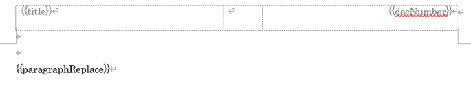
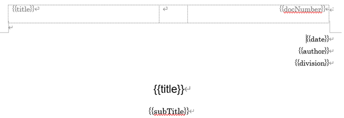

# Markdown Docx README

This is the README **Markdown Docx**. 

This extension uses a docx binary file for the template. 
If security check happens, you can download the template from this repo and set it as template in the settings.

some feature on version 0.0.1 are removed. sorry.

## Requirements

* Windows 10

We do not use Microsoft Word at version 0.0.2.

## Features

* **Markdown Docx** is a markdown converter to docx.
* **Markdown Docx** works for common mark md(s).
* Click **Convert Docx** at the context menu on the explore or the editor.
* In the editor, you can convert only the selection in the text.
* In the output tab, markdown-docx, the progress and the warns are displayed.
  
## Extensions for word

###### general

`<!-- word [command] parameters -->` is used for word command.


* `<!-- word docxTemplate _no_cover.docx -->`
  *  ` _no_cover.docx` is used for a docx template.

* `<!-- word levelOffset 1 -- >`
  * If your document start with `#`, set command `<!-- word levelOffset 1 -- >`.
  * First `#` line is used for the document title.

* `<!-- word toc 1 "table of contents" -->`

  * add toc
  * 1: levels of toc.
  * table of contents: toc caption

* `<!-- word import imported.md-->`

  imported.md will be imported.

* `<!-- word newPage -->`

  insert new page

* `<!-- word placeHolder "key" "the value" -->`

  `{{key}}` in a docx file is replaced to `the value`.

* `<!-- word refFormat [$n $t (p.$p)]]" -->`

  reference format  
  * `$n`: section number
  * `$t`: text
  * `$p`: page
  
  `[[1.1 this section (p.10)]]`

###### table

* `<!-- word tableWidth 90 -->`

  we can not get the template document width, so you adjust the width manually.
  you can set 10 to 100(%).

* `<!-- word cols 1,2 -->`

  columns width are 1:2

* `<!-- word rowMerge 1-4,5-6 -->`

  rows 1-4 and 5-6 are merged.

* `<!-- word emptyMerge -->`
  
  empty cells are merged. only row direction.


## sample markdown file

You can see the sample file in the [markdown-docx site](https://github.com/toramameseven/markdown-docx) md_demo folder.

## Extension Settings

### markdown docx

* markdown-docx.path.docxTemplate

  Set your original docx file for template.

* markdown-docx.docxEngine.mathExtension
   
  If set true, `$x+1$` type math is rendered.

* markdown-docx.docxEngine.debug  

  some debug option is enabled.  

  * intermediate files *.wd0, *.wd are not deleted.

* markdown-docx.docxEngine.isOverWrite

  if true, markdown-docx overwrites the word file.  

* markdown-docx.docxEngine.wordExePath

  set the full path of the word exe, if you want to open it.

* markdown-docx.docxEngine.isOpenWord

  If true, open the word file. 

### markdown vscode settings

like below

```markdown
  "[markdown]": {
    "editor.wordWrap": "off",
    "editor.quickSuggestions": {
      "other": true,
      "comments": false,
      "strings": false
    },
    "editor.snippetSuggestions": "top"
  },
```

## word template

It is better, set your language font.

### template files

You can see the some template in the [markdown-docx site](https://github.com/toramameseven/markdown-docx) templates folder.

* _with_cover.docx
* _no_cover.docx (default template)

In these template, you see the placeholder described at next section.

### place holder

[DOCX](https://docx.js.org/#/) type place folder is used.

Next place holders are used in the sample template.

* main content
  * `{{paragraphReplace}}
  * do not set this other information.

  

* for cover
  * `{{title}}`
  * `{{subTitle}}`
  * `{{author}}`
  * `{{division}}`
  * `{{date}}`
  * `{{docNumber}}`

  

markdown  
```
<!-- word placeholder title "sample document" -->
```

docx template
```
{{title}}
```

`{{title}}` is replaced to "sample document".


### styles

next styles are created.

* hh1 to hh4
    * `##` to `######`
    * If your document start with `#`, set command `<!-- word levelOffset 1 -- >`.
* wdHeading5
    * `######`, `#######`
* body1
* body2
* body3
* code
    * `\``
* codespan
    * "```"
* nList1
* nList2
* nList3
* numList1
* numList2
* numList3
* picture1
* note1
* warn1

* styleN: table style

* blockA

## Known Issues

* Inline math does not work.
* HTML does not work.
* Block quote does no work.
* The indent of table of contents is not good.

## vbs rendering does not support

## How to package

1. npm install -g vsce
1. vsce package --target win32-x64
1. vsce publish

## Acknowledgments

We thank for the wonderful npm packages.

[Packages](usedModules.md)

some feature are not active now.

And we use some useful articles below. 
* [markdown-to-txt](https://www.npmjs.com/package/markdown-to-txt) tells us how to use **Marked**.
* [marked-extended-tables](https://github.com/calculuschild/marked-extended-tables) is for merged table.
* To Slugify, we use Mr. Sato 's code (https://qiita.com/satokaz/items/64582da4640898c4bf42)
* [node-html-markdown](https://github.com/crosstype/node-html-markdown)'s code is used, for converting html to markdown.


## Release Notes

* 0.0.2
  * use [DOCX](https://docx.js.org/#/) for creating word files.
  * we do not support the vbs rendering on version `0.0.2`.
    
* 0.0.1
  * first Release.


